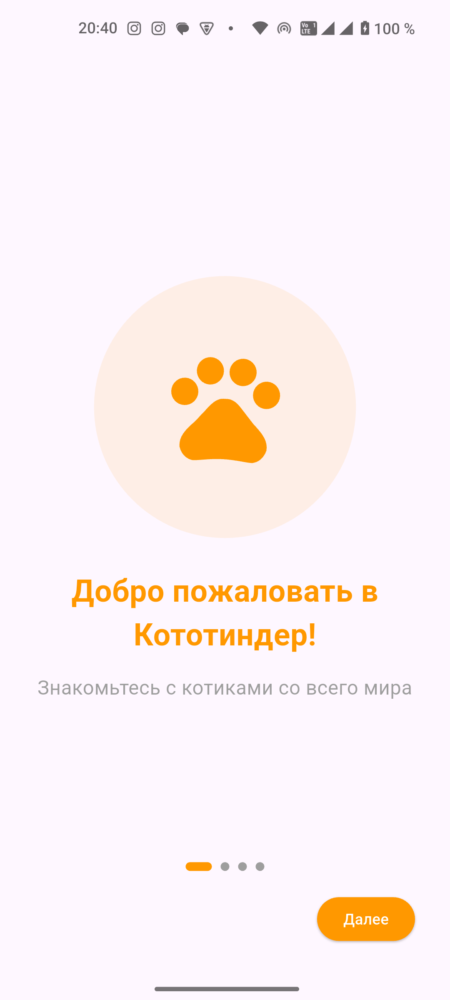
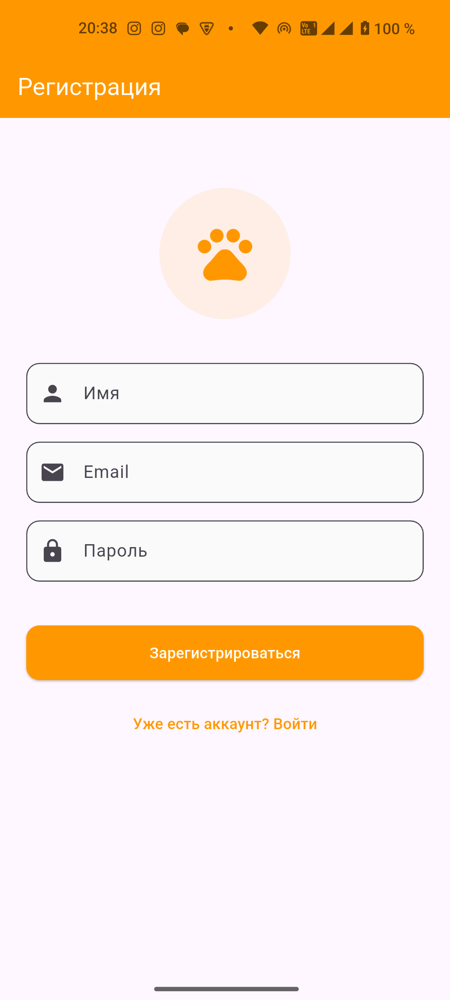
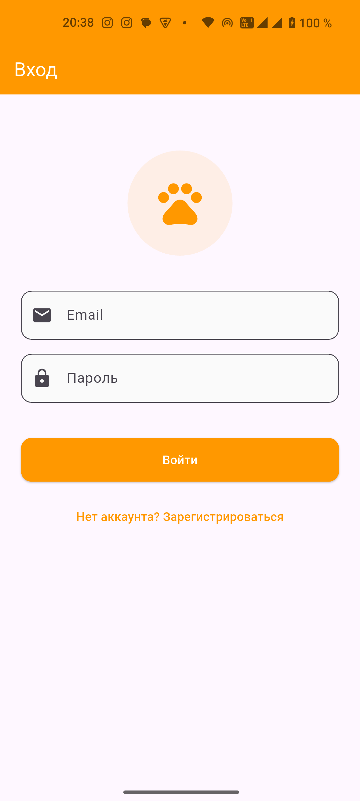
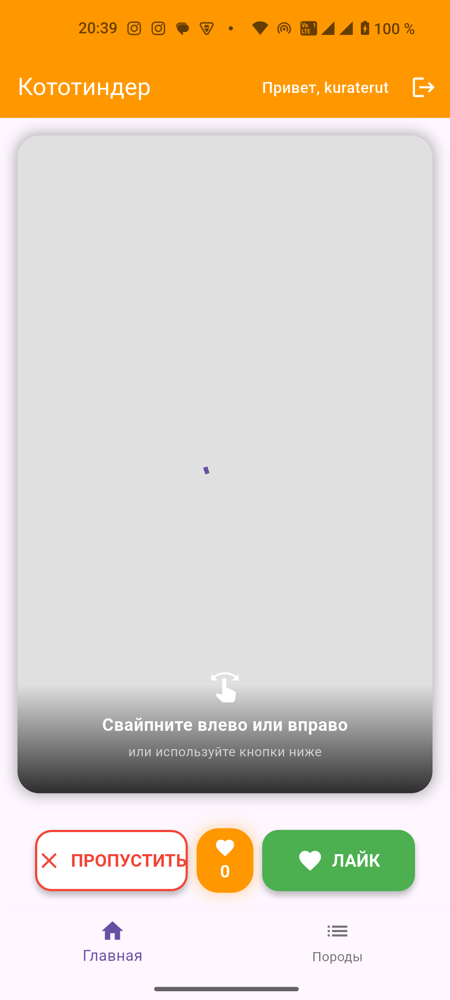
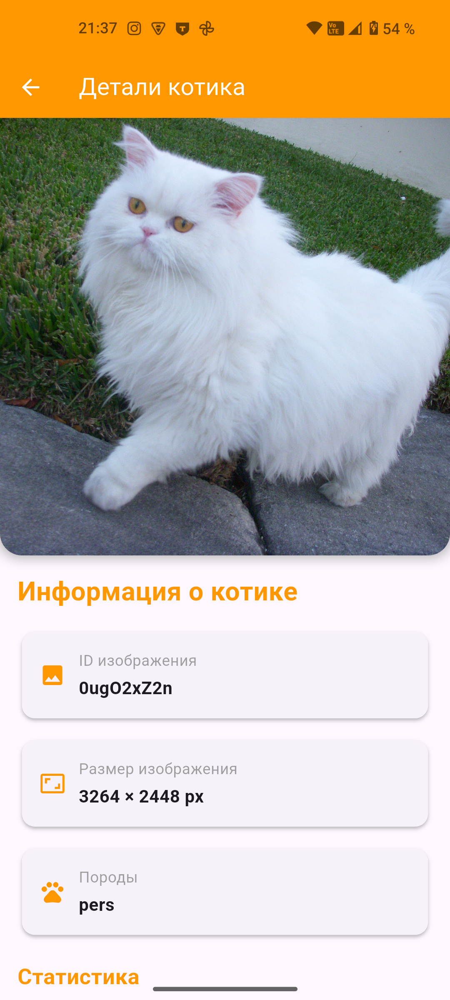
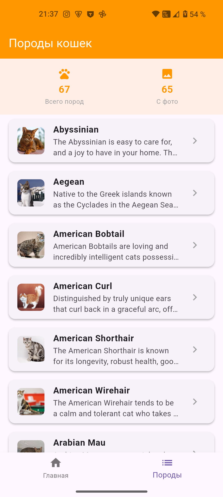
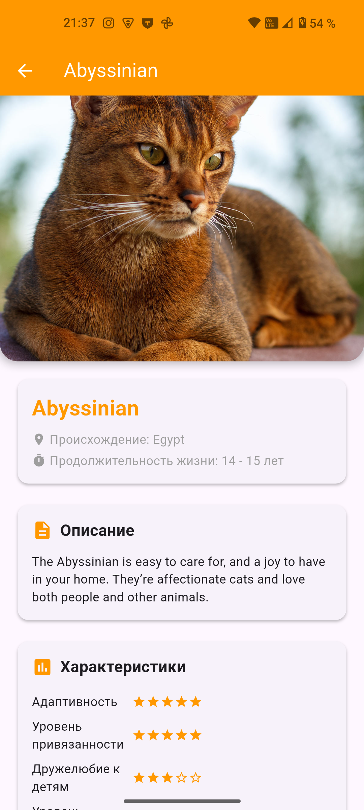

# CatTinder

## Описание:

Мобильное приложение ***Кототиндер*** разработано в 
рамках домашнего задания по курсу "Flutter Разработка" в НИУ ВШЭ.
Оно состоит из нескольких экранов: Онбординг, окно Авторизации/Регистрации, Главная и Породы. 

### Страница "Онбординг":
4 страницы с анимированными иконками, пролистываются горизонтально и имеют кнопки далее и назад

### Страницы "Авторизация и Регистрация":
На этих страницах можно зарегистрировать пользователя или войти в существуюзий аккаунт через почту и пароль

### Страница "Главная":
На Главной странице можно увидеть картинку котика и "поставить" ей ЛАЙК или ДИЗЛАЙК.
Если ставишь лайк, счетчик лайков увеличивается. Картинки можно свайпать. 
Если нажать на картинку, можно увидеть детальное ее описание.

### Страница "Породы":
На странице породы можно увидеть список пород котов и по нажатию открыть страницу с 
детальным описанием породы и характеристиками.

## Реализованные фичи:

### 1. Функциональные требования:

* Онбординг - появляется при первом запуске, анимированные слайды с прокруткой горизонтально
* Авторизация/регистрация - реализована с помощью SharedPreferences, keychain реализован с помощью FlutterSecureStorage
* На главном экране отображается случайное изображение котика
* Изображение котика можно свайпнуть влево/вправо иили нажать кнопки *ЛАЙК / ДИЗЛАЙК*
* При свайпе или по нажатию на кнопки меняется картинка
* При лайке счетчиков лайков увеличивается
* При нажатии на изображение появляется детальная информация о картинке и котике
* Есть Таб Бар с переключением между главной страницей и страницей Пород
* Тап на породу открывает детальную инфу о породе с описанием и характеристиками

### 2. Статический анализ кода:

* Код отформатирован командой ***dart flutter ./*** из корня проекта
* Подключен flutter_lints в конфигах
* Команда ***flutter analyze*** проходит успешно

### 3. Технические требования:

* Код реализован под clean arch
* Использован пакет http для api запросов, вся информация получается из соответствующих эндпоинтов (см. lib/utils/constants.dart)
* Использовался CachedNetworkImage для отображения картинок
* Сделана кастомная иконка приложения (см. assets/icons/cattinder.dart)
* Ошибки обрабатываются и выводится диалог с информацией
* Имеются unit-тесты и widget-тесты

### 4. Обязательные требования:

* APK файл https://github.com/kuraterut/CatTinder/releases/tag/release
* В README актуальное описание проекта, фичи и картинки с интерфейсом!

## Скрины

  
   
  
  
   
  
  

